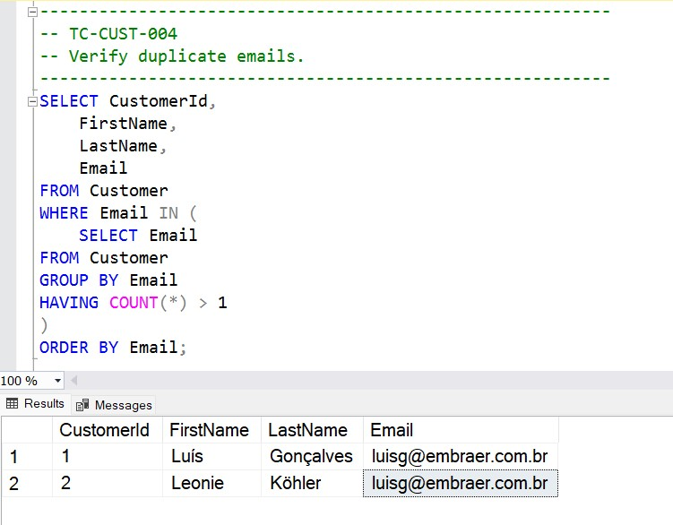
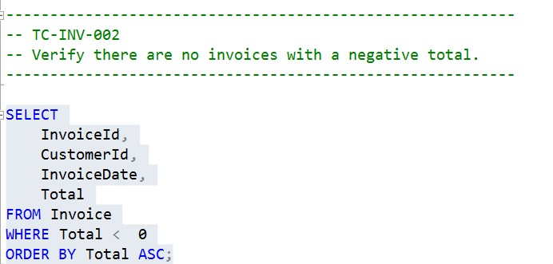
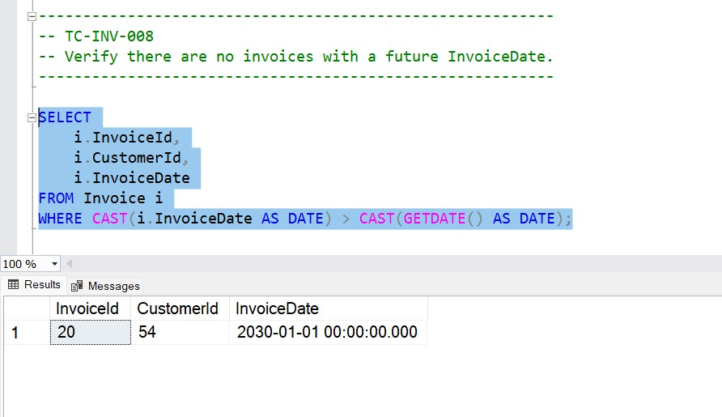
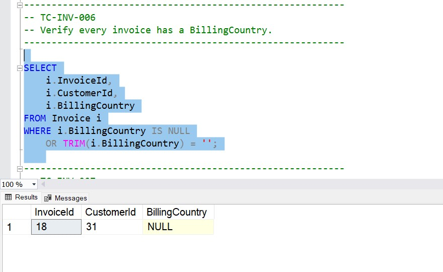
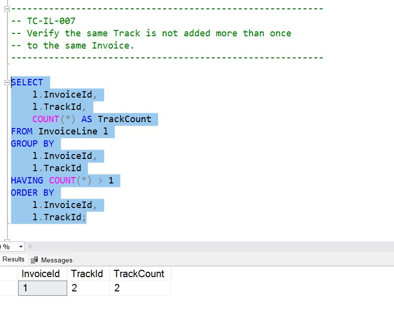

# SQL Data Validation Portfolio

## Overview

This repository demonstrates practical SQL data validation scenarios performed by QA Analysts to verify backend data accuracy, integrity, and consistency.

Using the Chinook sample database, this project simulates real-world QA testing activities including data integrity checks, duplicate detection, NULL validation, business rule validation, and financial reconciliation.

The Chinook database provides a realistic relational dataset containing customers, invoices, invoice lines, tracks, and supporting tables for validation exercises.

The SQL scripts represent validation techniques used during functional testing, regression testing, integration testing, and user acceptance testing to ensure application data meets expected requirements.


---

## Tools & Technologies

- Microsoft SQL Server
- SQL
- Chinook Sample Database
- Git
- GitHub

---

## How to Run the SQL Scripts

1. Install Microsoft SQL Server and SQL Server Management Studio (SSMS).
2. Restore or configure the Chinook sample database.
3. Open the SQL scripts located in the `/sql` folder.
4. Execute the scripts against the Chinook database.
5. Review the results to validate expected data conditions.

Test data scripts located in `/test-data` can be used to simulate defects and restore the database state.

---

## Skills Demonstrated

- SQL Query Development & Data Analysis
- Backend Data Validation
- Database Testing
- Test Data Validation
- Functional Testing
- Regression Testing
- Data Integrity Validation
- Referential Integrity Checks
- Business Rule Validation
- Duplicate Detection
- NULL Validation
- Aggregate Functions
- JOINs
- GROUP BY / HAVING
- Subqueries
- Common Table Expressions (CTEs)
- Window Functions

---

## Project Structure

```
sql-data-validation-portfolio/
│
├── README.md
├── LICENSE
│
├── sql/
│   ├── 01_customer_validation.sql
│   ├── 02_invoice_validation.sql
│   └── 03_invoice_line_validation.sql
│
├── test-cases/
│   ├── 01_Customer_Test_Cases.md
│   ├── 02_Invoice_Test_Cases.md
│   └── 03_InvoiceLine_Test_Cases.md
│
├── bug-reports/
│   ├── BUG-001_Duplicate_Customer_Email.md
│   ├── BUG-002_No_Customer_Email.md
│   └── additional bug documentation
│
├── test-data/
│   ├── 01_insert_test_defects.sql
│   └── 02_restore_test_data.sql
│
├── docs/
│   └── Test_Summary_Report.md
│
└── validation-evidence/
    ├── BUG-001.jpg
    ├── BUG-002.jpg
    └── BUG-004.jpg
    └── BUG-005.jpg
    └── BUG-006.jpg
```
---

## QA Artifacts Included

This repository includes QA documentation and supporting artifacts used during backend validation testing:

- SQL validation scripts for backend data verification
- Test cases covering functional and data validation scenarios
- Bug reports documenting defects, severity, and validation evidence
- Test data scripts for defect simulation and database restoration
- Test summary report documenting testing activities and results
- Screenshots providing validation evidence

---

## Validation Evidence

The following screenshots demonstrate examples of SQL validation results and documented defect scenarios.

### Duplicate Customer Email Validation



### Negative Invoice Total Validation



### Future Invoice Date Validation



### Missing Billing Country Validation



### Duplicate Track On Same Invoice



---

## Validation Modules

### Customer Validation

- Customer retrieval
- Duplicate email detection
- Duplicate customer detection
- Missing email validation
- Support Representative validation

### Invoice Validation

- Invoice retrieval
- Negative invoice totals
- Missing billing information
- Future invoice dates
- Invoice-to-customer validation
- Invoice total reconciliation

### Invoice Line Validation

- Quantity validation
- Unit price validation
- Invoice relationship validation
- Track relationship validation
- Duplicate invoice line detection
- Duplicate track detection
- Invoice integrity validation

---

## Future Enhancements

- Additional reporting validation scenarios
- More complex regression validation queries
- Automated database validation scripts
- Additional defect simulation scenarios
- Expanded test coverage for new modules

---

## About This Project

This portfolio demonstrates backend SQL validation skills and practical QA techniques used to verify application data quality in enterprise environments. The scenarios are modeled after real-world testing activities performed in Agile software development teams, including functional testing, regression testing, and defect validation.

---

## Author

**Anita Cruz**

Senior Quality Assurance Analyst
